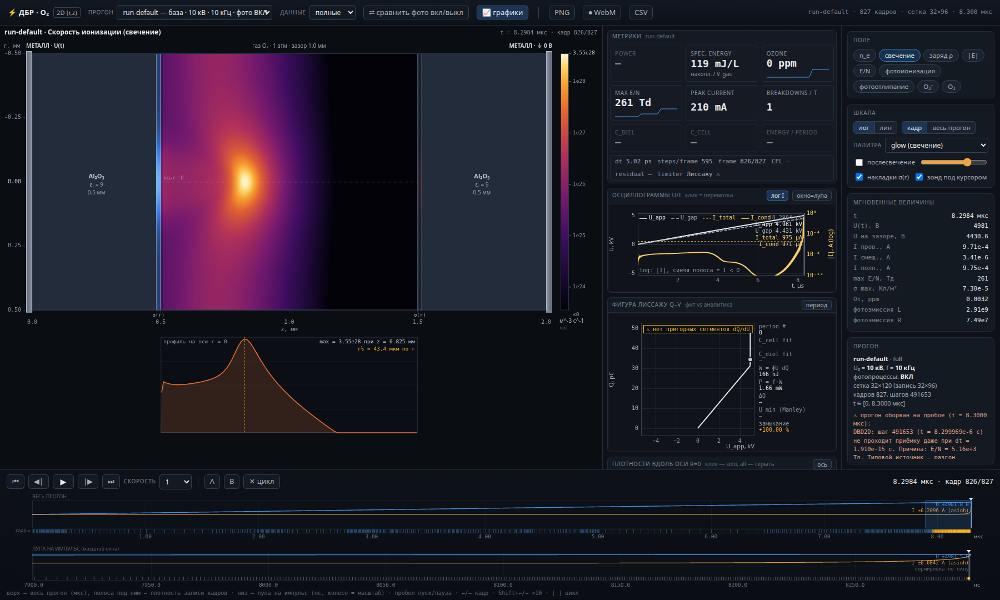

# dbd-o2 — ДБР в чистом кислороде: 2D осесимметричная fluid-модель с фотопроцессами

> **English summary.** A self-consistent fluid model of a dielectric barrier discharge in pure O₂ at atmospheric pressure: drift-diffusion in the local field approximation, a Poisson equation with variable permittivity and surface charge on the barriers, nine particle species, photoprocesses. The 2D axisymmetric solver runs offline in Node.js and writes frames; the web player replays them. The 1D model runs live in the browser. Zero dependencies, zero build, zero CDNs. **Live site (English / Russian):** https://barier.makseq.com — its deployed copy is in [`site/`](site/) (precomputed run data is not in the repository; the site serves it from `site/data/`, ~51 MB, reproducible with `sim2d/run.mjs`). Built by Max Tkachenko together with Claude Code. The rest of this README is in Russian.


Самосогласованная fluid-модель объёмного **диэлектрического барьерного разряда (ДБР)**
в чистом O₂ при 1 атм. Основная часть — **2D осесимметричный (r,z) солвер с фотопроцессами**
(офлайн-расчёт в node.js, результат — кадры на диске) и **веб-плеер**, который эти кадры
проигрывает. Одномерная модель, с которой всё начиналось, сохранена и описана в
[`docs/README_1D.md`](docs/README_1D.md).

Чистый ES2022. Ноль зависимостей, ноль сборки, ноль CDN — ни в солвере, ни в плеере.

```
      r
  R=0.5мм ┌───────┬───────────────────────┬───────┐
          │ Al₂O₃ │   газовый зазор O₂    │ Al₂O₃ │   зеркальная стенка (Neumann)
          │ ε_r=9 │  1.0 мм, 1 атм, 300 K │ ε_r=9 │
    r=0   ├───────┼───────────────────────┼───────┤ ← ось симметрии (Neumann)
          │0.5 мм │                       │0.5 мм │
          └───────┴───────────────────────┴───────┘
        z=0                                      z=2 мм
     металл                                    металл
   φ = U₀ sin(2πft)                              φ = 0
   U₀ = 10 кВ, f = 10 кГц
```

Затравка: фон 1e13 м⁻³ **плюс** гауссово пятно на оси у поверхности диэлектрика
(σ_r = 40 мкм). Без пятна филамент не зарождается (`ERRATA B6`) — модель просто
даёт диффузный таунсендовский разряд.

---

## Быстрый старт

```bash
./serve.sh                 # http://127.0.0.1:8777/player/  — 2D-плеер на готовых данных
./serve.sh 9000            # другой порт
```

ES-модули не грузятся с `file://` (CORS), поэтому нужен http-сервер; `serve.sh`
использует `python3 -m http.server`, а если его нет — встроенный node-сервер.
Готовые прогоны уже лежат в `data/`, считать ничего не нужно.

| URL | что открывается |
|---|---|
| `/player/` | **2D-плеер** (r,z): поле, σ(r), осциллограммы, Лиссажу, фотопроцессы |
| `/player/plots-demo.html` | автономная демостраница графиков (только графики, без сцены) |
| `/index.html` | старый **1D**-UI с живым 1D-солвером (см. `docs/README_1D.md`) |

### Свой расчёт

```bash
# один пробой в филаментном режиме, сетка 32×120, фотопроцессы включены
node sim2d/run.mjs --preset filament --nr 32 --nz 120 --nzDiel 12 \
     --betaR 1.4 --betaG 1.5 --U0kV 10 --freqKHz 10 --photo on \
     --periods 0.14 --out data/my-run

node sim2d/summarize.mjs data                 # таблица приёмки по всем прогонам
node sim2d/compare-photo.mjs data/run-default data/run-nophoto
```

Прогресс идёт в **stderr**, в stdout — только итоговый JSON (можно в `| jq`).
Раннер понимает `SIGINT/SIGTERM/SIGHUP` (мягкая остановка с записью манифеста),
`--maxSeconds`, `--maxSteps`, `--checkpointSec`, `--maxBytesFull/--maxBytesCompact`.
Полный список — `node sim2d/run.mjs --help`.

Ровно те пять прогонов, что лежат в `data/`:

```bash
G="--preset filament --nr 32 --nz 120 --nzDiel 12 --betaR 1.4 --betaG 1.5"
node sim2d/run.mjs $G --out data/run-default --U0kV 10 --freqKHz 10 --photo on  --periods 0.14
node sim2d/run.mjs $G --out data/run-nophoto --U0kV 10 --freqKHz 10 --photo off --periods 0.14
node sim2d/run.mjs $G --out data/run-low     --U0kV 6  --freqKHz 10 --photo on  --periods 0.20
node sim2d/run.mjs $G --out data/run-high    --U0kV 14 --freqKHz 10 --photo on  --periods 0.10
node sim2d/run.mjs $G --out data/run-fast    --U0kV 10 --freqKHz 30 --photo on  --periods 0.40
```

### Тесты

```bash
node sim2d/tests/physics.test.mjs    # 61
node sim2d/tests/poisson.test.mjs    # 14
node sim2d/tests/solver.test.mjs     # 153
node sim2d/tests/recorder.test.mjs   # 12
node sim2d/tests/photo.test.mjs      # 18
node test/solver.test.mjs            # 1D-ядро, 55 тестов (~70 с)
```

---

## Что считается

### Физика

Дрейф-диффузионное приближение (LFA: коэффициенты — функции локального `E/N`),
самосогласованное с уравнением Пуассона, плюс поверхностный заряд на обоих барьерах.

Сорта: `e`, `O₂⁺`, `O₄⁺`, `O⁻`, `O₂⁻`, `O₃⁻`, `O`, `O₃`, `O₂(a¹Δg)`.
Ключевые каналы (полностью — `docs/PHYSICS.md`, поправки — `docs/ERRATA.md §D`):

* ударная ионизация и **диссоциативное прилипание** `e + O₂ → O⁻ + O`,
  трёхтельное `e + 2O₂ → O₂⁻ + O₂` — электроотрицательность газа определяет всё
  поведение между импульсами;
* конверсия `O⁻ → O₃⁻` (O₃⁻ — доминирующий отрицательный ион в паузе),
  ион-ионная рекомбинация `k_ii = 2e-13 + 2e-37·N` (трёхтельный вклад — ×25 к
  двухтельному при атмосферном давлении);
* полевое отлипание **D6** и столкновительное **D1/D7** (см. ограничения: там
  неустранённая неопределённость ×18–26);
* образование озона, вторичная эмиссия с диэлектрика γ = 0.02.

### Фотопроцессы (`docs/PHOTO_PROCESSES.md`)

Три спектральных окна, три механизма — все включаются/выключаются по отдельности
(`--photo on|off` переключает разом):

| механизм | как считается |
|---|---|
| **фотоионизация** | трёхчленная гельмгольцева аппроксимация (Бурдон), длины поглощения 238 / 90 / 14.8 мкм при p(O₂) = 760 Торр |
| **фотоэмиссия** с барьеров | view factor от объёмного источника к поверхности |
| **фотоотлипание** от O₃⁻ | прозрачное ядро `1/(4πR²)` — газ в этом окне не поглощает |

Что это даёт количественно — раздел «Влияние фотопроцессов» ниже.

### Численная схема (`docs/NUMERICS_2D.md`)

* сетка (r,z) неравномерная: `betaR = 1.4` по радиусу, `betaG = 1.5` по зазору,
  `dr₀ = 7.3 мкм` на оси (3–4 ячейки на полуширину филамента);
* потоки — Шарфеттер–Гуммель, явный транспорт, `dt ≤ δ·dr²/(2D_e)`;
* Пуассон — симметризованный `L_r`, разделимый предобусловливатель + PCG,
  `strictGauss` (приёмка шага по невязке Гаусса);
* шаг по времени адаптивный: CFL, диффузионный, реакционный, `dE/E`, σ-критерий;
  в тёмной фазе лимитирует диффузия (`dt ≈ 3.5e-11 с`), на фронте — химия;
* запись: `frames.bin` (квантованные поля, log/asinh-кодеки) + `series.bin`
  (скалярные ряды) + `manifest.json`; два уровня детализации (`full`, `compact`).

---

## Плеер



Слева — сцена (r,z), справа — колонка графиков, ниже — двухдорожечный таймлайн
(весь прогон + лупа на импульс, колесо мыши меняет масштаб лупы).

**Сцена.** Ориентация: `z` — горизонталь (металл слева и справа), `r` — вертикаль,
зеркально относительно оси. Растр строится в **физических координатах**, а не по
индексам сетки: сетка неравномерная, растяжение по индексам показало бы филамент
вдвое шире, чем он есть. Диэлектрики заштрихованы, поверхностный заряд σ(r)
нарисован полосами у обеих поверхностей (расходящаяся шкала, симметричная
нормировка по максимуму |σ| за весь прогон). Под сценой — профиль поля вдоль оси
r = 0 с подписью полуширины `r½`.

**Графики** (`player/js/plots.mjs`, контракт — `player/js/PLOTS_API.md`):
осциллограммы U/I с min/max-декимацией (импульс 20 нс в окне 100 мкс не теряется),
фигура Лиссажу Q–V с извлечением ёмкостей и сверкой с аналитикой, плотности вдоль
оси, σ(r) на обеих поверхностях, панель фотопроцессов (объёмный темп событий, лог-ось,
`S_ph/S_imp` в точке курсора) и плитки метрик.

**Синхронизация.** Один курсор времени на всё: скраб таймлайна двигает точку на
фигуре Лиссажу и курсор осциллограммы, клик по осциллограмме перематывает плеер.

**Экспорт.** `PNG` — текущий кадр (в режиме сравнения — обе сцены рядом) с подписью
прогона, поля и времени; `⏺ WebM` — запись анимации через `MediaRecorder` от текущего
кадра до конца прогона или до конца участка A–B; `CSV` — все временные ряды прогона
(`t, Uapp, Ugap, Icond, Idisp, Itot, Q, maxEN, o3ppm, sigmaMax, photoEmitTotalL/R`).

**Клавиши.** Пробел — пуск/пауза, ←/→ — кадр (Shift — ×10), Home/End, `[` `]` — метки
цикла, `\` — сброс цикла.

### Что видно на скриншотах (`docs/shots/`, реальный `run-default`, полные данные)

| файл | что на нём |
|---|---|
| `01-before.png` | **t = 4.01 мкс, до пробоя.** Ток чисто ёмкостный (I пров. 4.2e-9 А против I смещ. 3.8e-6 А), max E/N = 92 Тд. Электронное облако широкое, снесено дрейфом к заземлённому барьеру; затравочное пятно уже размыто |
| `02-front.png` | **t = 8.2984 мкс, головка стримера в полёте.** Ионизация сжата в пятно `r½ = 43 мкм` на оси при R = 500 мкм, максимум на z = 0.825 мм — головка оторвалась от катодного барьера и идёт к аноду. I пров. = 971 мкА, max E/N = 261 Тд |
| `03-ipeak.png` | **t = 8.2994 мкс, пик тока (0.2096 А).** Объёмный заряд ρ: положительный (красный) фронт впереди и по бокам канала, отрицательный (синий) хвост на оси к барьеру z = 0.5 мм — классическая структура стримера. `r½ = 31.6 мкм`, max E/N = 1806 Тд |
| `04-afterglow.png` | **послесвечение.** Накопленный след показывает путь головки через весь зазор; тёмное тело канала за фронтом — ионизация в канале подавлена, поле экранировано объёмным зарядом |
| `05-compare.png` | **фото ВКЛ против фото ВЫКЛ**, обе сцены на общей шкале (без синхронной шкалы покадровая автошкала выравнивает яркость и разница исчезает) |
| `06-plots-bottom.png` | нижние панели: плотности вдоль оси, σ(r) на обеих поверхностях, фотопроцессы (`S_ph/S_imp = 2.9e-4`) |

---

## Валидация

Полная таблица и разборы — `docs/VALIDATION.md`. Коротко:

| # | Критерий | Вердикт |
|---|---|---|
| V4a | `C_cell` (аналитика/солвер), 6.2587e-15 Ф | **ПРОЙДЕНО** (9 знаков) |
| V13 | `C_cell·U₀` | **ПРОЙДЕНО** |
| V8a/b | σ после пробоя, поле памяти | **ПРОЙДЕНО** (−10…−15 %) |
| V9 | отрицательные ионы > n_e после импульса | **ПРОЙДЕНО** (×2.5e3 через 300 нс) |
| V10 | выход O₃ | **ПРОЙДЕНО** по порядку величины |
| V12 | сохранение заряда за период | **ПРОЙДЕНО**, 1e-14…3e-13 (после починки двух дефектов) |
| V2c | `U_gap` зажигания не растёт с U₀ | **ПРОЙДЕНО** (разброс 4.6 % при U₀ = 6…20 кВ) |
| V2a/b | численное значение напряжения пробоя | **НЕ СХОДИТСЯ** (+29.5 %), причина установлена: формативное запаздывание |
| V7b/c | FWHM импульса и плотность тока | **НЕ СХОДИТСЯ** (×15…×270): нет внешней цепи, режим не таунсендовский |
| V4b, V5 | ёмкости из петли Лиссажу, мощность по Мэнли | **НЕ ИЗМЕРЕНО**: полный период не досчитывается (см. ограничения) |

Отдельно проверено, что фит Лиссажу работает: на синтетическом прогоне с полным
периодом `C_cell = 6.26 фФ` — **0.0 %** к аналитике, `C_diel = 69.1 фФ` (+10.4 %),
R² = 0.997. На реальных (оборванных) прогонах панель показывает `C_cell` и
**отказывается** предъявлять `C_diel`, вешая бейдж «петля не замкнута» — молча
выдать наклон по кривой петле хуже, чем не выдать вовсе.

### Пять прогонов в `data/`

| прогон | U₀ / f | фото | досчитано | I_peak | n_e(0)/n_e(R) | r½ | филамент |
|---|---|---|---|---|---|---|---|
| `run-default` | 10 кВ / 10 кГц | вкл | 8.30 мкс | 0.210 А | 1.2e6 | 31.0 мкм | **да** |
| `run-nophoto` | 10 кВ / 10 кГц | выкл | 8.34 мкс | 0.448 А | 1.0e9 | 20.9 мкм | **да** |
| `run-low` | 6 кВ / 10 кГц | вкл | 14.72 мкс | 0.277 А | 4.7e-4 | — | нет, диффузный |
| `run-high` | 14 кВ / 10 кГц | вкл | 5.76 мкс | 0.273 А | 7.1e6 | 32.1 мкм | **да** |
| `run-fast` | 10 кВ / 30 кГц | вкл | 2.60 мкс | 0.198 А | 2.2e8 | 28.8 мкм | **да** |

Все пять обрываются на **первом** пробое (6–15 % периода) — см. ограничения.

### Влияние фотопроцессов (`run-default` против `run-nophoto`)

| величина | фото ВКЛ | ВЫКЛ | разница |
|---|---|---|---|
| момент зажигания | 8.2984 мкс | 8.3355 мкс | **−37.1 нс (−0.45 %)** |
| I_peak | 0.2096 А | 0.4475 А | **−53 %** |
| радиус r½ | 31.0 мкм | 20.9 мкм | **+48 %** |
| n_e на оси | 1.62e23 | 4.02e23 м⁻³ | −60 % |
| max E/N | 2461 Тд | 3367 Тд | −27 % |
| энергия ∫U·I dt | 1.655e-7 Дж | 1.999e-7 Дж | −17 % |

**На момент зажигания фотопроцессы влияют слабо, на морфологию — качественно:**
без них модель даёт систематически пересжатый филамент — вдвое уже, вдвое плотнее,
вдвое сильноточнее. Оговорка обязательна: оба снимка сняты в момент аварийной
остановки, предъявлять можно отношения и знаки, а не абсолютные величины.

---

## Ограничения — честный список

Ни один пункт отсюда не «допиливается настройкой»; это границы применимости модели.

### 1. Осесимметрия: азимутальных мод нет принципиально

Модель описывает **только центральный канал**. Внеосевой филамент в геометрии (r,z)
становится **кольцом**, а не пятном. Азимутальные филаментационные моды отсутствуют
не приближённо, а по построению: в уравнениях нет ∂/∂φ.

Следствие: **самоорганизация решётки микроразрядов не воспроизводится вообще** — ни
гексагональная упаковка каналов, ни их взаимное отталкивание, ни статистика числа
каналов на площадь. Всё, что показывает плеер, — это один канал на оси и его радиальный
профиль. Сравнивать с фотографиями решётки микроразрядов нельзя.

### 2. Прогоны обрываются на первом пробое

Ни один реальный прогон не доходит до конца периода: солвер расходится в
**пристеночной** ячейке на повторном зажигании (`VALIDATION.md §8`). Измельчение сетки
это не лечит: структура остаётся шириной в одну ячейку, `ρ ∝ 1/dz`, момент аварии
сходится к 22.3 мкс. Гипотеза «поможет граничное условие Хагелаара» **проверена и
опровергнута** (§13.2): в 2D оно даёт аварию на 8.4534 мкс вместо 8.5071 мкс и `n_e`
на два порядка хуже — потому что в 1D оно работало в связке с полунеявным
пристеночным потоком, а в 2D пристеночные грани в полунеявную задачу не входят.

Отсюда: **V4b, V5 и V6 не измерены**, фигура Лиссажу не замкнута, и любые
интегральные величины за период (мощность, перенесённый заряд) в плеере помечены
предупреждением, а не показаны числом.

### 3. Цена счёта: требуемая сетка 80×160 нереальна

Замерено, а не оценено (`VALIDATION.md §13.1`):

| сетка | dr₀ | dt в тёмной фазе | часов на 1 мкс |
|---|---|---|---|
| 80×160 (требование ТЗ) | 2.56 мкм | 9.6e-12 с | **~1.5** → 2 периода = **12 суток** |
| **32×120 (взято)** | 7.3 мкм | 3.5e-11 с | **0.23–0.29** |

Причина схемная: явный транспорт, `dt ≤ δ·dr²/(2D_e)`, измельчение по радиусу бьёт
дважды. Требование «40 мин на период» быстрее самой грубой допустимой сетки примерно
в 600 раз. Лечится только неявным z-транспортом электронов (`NUMERICS_2D §4.5`).

### 4. D6 (полевое отлипание): неопределённость ×18–26 не устранена

Два независимых экспертных ревью разошлись в том, какую массу подставлять в
соотношение Ваннье при вычислении `T_eff`: полную массу нейтрала или приведённую.
Разница в частоте отлипания — **×26.3 при 30 кВ/см и ×18.2 при 37.8 кВ/см**, и она
зависит от поля, то есть не сводится к постоянному множителю.

Принята **полная масса нейтрала** (`d6MassConvention: 'neutral'`) — по
методологическому, а не физическому основанию: `k = 2.7e-16·√(T_eff/300)·exp(−5590/T_eff)`
это эмпирический фит Kossyi et al. 1992, и подставлять в чужой предэкспонент чужое
определение `T_eff` нельзя независимо от того, какая конвенция физичнее. Конвенция
вынесена в параметр, развёртка по ней есть в `VALIDATION.md §5б`. **Это остаётся
открытым вопросом, а не решённым.**

### 5. Веса фотоионизации перенесены из воздуха

Длины поглощения `λ_j` переносятся законно: это поглощение **кислородом**, оно
масштабируется парциальным давлением O₂ (воздух → чистый O₂ — все длины короче в 5.0 раз).
А вот веса `A_j = [0.07, 0.26, 0.67]` кодируют форму **азотного** эмиссионного спектра
в окне 98–102.5 нм, свёрнутую с сечением поглощения O₂. Спектр собственного излучения
O₂ в этом окне другой и **неизвестен**. Веса вынесены в параметр `photoIonWeights`,
развёртка по ним обязательна при любой количественной интерпретации фотоионизации.

### 6. γ = 0.02 — круговая калибровка, а не подтверждение

Коэффициент вторичной эмиссии подобран так, чтобы получить напряжение пробоя 3.8 кВ,
после чего 3.8 кВ использовалось как «валидация». Это круг. Правильная форма
предъявления — зависимость `U_br(γ)` в диапазоне 0.005…0.05, она снята
(`VALIDATION.md §5а`); как независимое подтверждение физики γ не годится.

### 7. Прочее, что стоит знать

* **LFA** (коэффициенты по локальному `E/N`) на фронте стримера строго говоря
  неприменима — нужен перенос энергии электронов (LMEA). Это же — вероятная
  первопричина п. 2.
* **Нет внешней цепи** (балластный резистор, индуктивность). Из-за этого импульс тока
  выходит в ×15…×270 короче и плотнее наблюдаемого (V7b/V7c).
* **Затравка 1e13 м⁻³** — численная затравка первого запуска, а не «память предыдущего
  цикла»: в чистом O₂ через 50 мкс память хранится в парах ионов, а не в свободных
  электронах.
* **В контейнер кадров пишутся 3 сорта из 9** (`n_e`, `n_O3m`, `n_O3`) — остальные шесть
  в плеере честно помечены `×` «сорт не записан в прогоне» и не рисуются.
  Столкновительного отлипания в контейнере нет вообще.
* **`run-synth`** в списке прогонов — синтетический контейнер для отладки формата,
  а не решение уравнений; плеер помечает его отдельно.

---

## Структура

```
sim2d/            2D осесимметричный солвер
  solver2d.mjs      шаг по времени, транспорт, ГУ, поверхностный заряд
  physics2d.mjs     коэффициенты, химия, таблицы по E/N
  poisson2d.mjs     Пуассон (r,z) + предобусловливатель + PCG
  photo2d.mjs       три фотопроцесса (PHOTO_API.md — контракт)
  recorder.mjs      формат записи: frames.bin / series.bin / manifest.json
  run.mjs           CLI-раннер
  summarize.mjs     приёмка: есть ли филамент, что досчитано
  compare-photo.mjs сравнение прогонов фото вкл/выкл
  tests/            258 тестов
player/           веб-плеер (ES-модули, без сборки)
  index.html, css/player.css
  js/loader.mjs     чтение контейнера
  js/scene.mjs      сцена (r,z), σ(r), профиль на оси, послесвечение, зонд
  js/plots.mjs      осциллограммы, Лиссажу, профили, фотопанель
  js/metrics.mjs    плитки метрик, форматтеры, аналитика ёмкостей
  js/app.mjs        состояние, транспорт, таймлайн, сравнение, экспорт
  js/PLOTS_API.md   контракт графиков
  plots-demo.html   автономная демостраница графиков
data/             результаты прогонов (+ `-compact` версии)
docs/             ERRATA (приоритетна), NUMERICS_2D, PHOTO_PROCESSES, PHYSICS,
                  VALIDATION, RATES_REVIEW, REFERENCE_TARGETS, UI_SPEC,
                  DIVERGENCE_ANALYSIS, shots/, README_1D.md
src/, test/, index.html   1D-модель и её UI (docs/README_1D.md)
```

Порядок чтения документов: **`docs/ERRATA.md` приоритетна над всеми остальными** —
там блокеры A1…A6, ловушки осесимметричного решателя B1…B6, исправленные критерии
валидации (раздел C) и исправленные коэффициенты (раздел D). Где ERRATA противоречит
другим докам — права ERRATA.
